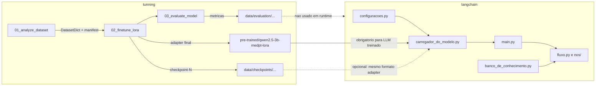

# Artefatos `tunning` e uso em `langchain`

## Fluxo de dados e modelo (visão geral)

---

## 1. Artefatos por script em `tunning`

### [tunning/01_analyze_dataset.py](c:\WORKSPACES\workspace-PYTHON\Tech-Challenge-FIAP-FASE3\tunning\01_analyze_dataset.py)

| Saída típica | Conteúdo | Uso em `langchain` |
|---------------|----------|-------------------|
| `data/processed/medpt_qa` (ou `--output-dir`) | `DatasetDict` em disco (treino/val/teste) | **Não** para execução da triagem. Só alimenta o script 02. |
| Manifesto JSONL / relatório JSON | Metadados e estatísticas do processamento | **Não** usados pelo grafo LangChain. |

**Conclusão:** o LangChain de triagem **não precisa** ler esses arquivos para inferência; mantêm-se apenas na cadeia de treino.

### [tunning/02_finetune_lora.py](c:\WORKSPACES\workspace-PYTHON\Tech-Challenge-FIAP-FASE3\tunning\02_finetune_lora.py)

| Saída típica | Conteúdo | Uso em `langchain` |
|---------------|----------|-------------------|
| **`pre-trained/qwen2.5-3b-medpt-lora`** (ou `--final-dir`) | `adapter_config.json`, `adapter_model.safetensors` (ou `.bin`), tokenizer, `training_metadata.json` | **Principal artefato do LLM** para o LangChain: carregar base + `PeftModel` com essa pasta. |
| `data/checkpoints/qwen2.5-3b-medpt-lora/checkpoint-*` | Snapshots intermediários (também formato adapter/PEFT) | **Opcional:** usar um `checkpoint-NNNN` específico em vez do export final, se quiser reproduzir o mesmo passo que a avaliação. |

**Conclusão:** o que o LangChain deve obedecer como “solução LoRA” é **adapter + tokenizer salvos pelo 02**, com o **mesmo modelo base** configurado no treino (`Qwen/Qwen2.5-3B-Instruct` por padrão).

### [tunning/03_evaluate_model.py](c:\WORKSPACES\workspace-PYTHON\Tech-Challenge-FIAP-FASE3\tunning\03_evaluate_model.py)

| Saída típica | Uso em `langchain` |
|---------------|-------------------|
| `data/evaluation/.../evaluation_summary.json`, `predictions.jsonl` | **Não** — qualidade offline; não entram no `invoke` do grafo. |

---

## 2. O que `langchain` já consome hoje (alinhado ao treino)

- **[langchain/carregador_do_modelo.py](c:\WORKSPACES\workspace-PYTHON\Tech-Challenge-FIAP-FASE3\langchain\carregador_do_modelo.py):** prioridade `LOCAL_MODEL_PATH` (modelo causal completo, ex. merge) → **LoRA** via `LORA_ADAPTER_PATH` / resolução de `CAMINHO_DO_ADAPTER_LORA` / auto-descoberta `pre-trained/qwen2.5-3b-medpt-lora` → Ollama → pipeline Hub com `HF_PIPELINE_MODEL` ou fallback `CAMINHO_DO_MODELO`. Carregamento LoRA espelha a ideia do script 03 (base quantizada na GPU; CPU sem 4-bit). **Chat template** + mensagem de sistema alinhada ao treino quando o tokenizer suporta.
- **[langchain/configuracoes.py](c:\WORKSPACES\workspace-PYTHON\Tech-Challenge-FIAP-FASE3\langchain\configuracoes.py):** `CAMINHO_DO_MODELO` (base), `CAMINHO_DO_ADAPTER_LORA`, `MENSAGEM_SISTEMA_LLM` — ponto único de defaults coerente com `tunning`.
- **[langchain/main.py](c:\WORKSPACES\workspace-PYTHON\Tech-Challenge-FIAP-FASE3\langchain\main.py)** e **[langchain/fluxo.py](c:\WORKSPACES\workspace-PYTHON\Tech-Challenge-FIAP-FASE3\langchain\fluxo.py)** / **`nos/`:** apenas recebem o objeto retornado por `carregar_modelo()` e chamam `invoke` / `.content` — **não exigem** alteração para “usar LoRA”, desde que o carregador devolva o runnable compatível (já o caso).
- **[langchain/banco_de_conhecimento.py](c:\WORKSPACES\workspace-PYTHON\Tech-Challenge-FIAP-FASE3\langchain\banco_de_conhecimento.py):** PDFs locais + FAISS + `MODELO_DE_EMBEDDING` — **independente** dos artefatos de treino LoRA; continua sendo o RAG dos protocolos.

**Arquivo auxiliar:** [.env.example](c:\WORKSPACES\workspace-PYTHON\Tech-Challenge-FIAP-FASE3\.env.example) documenta variáveis para apontar adapter, base, Ollama ou modelo leve.

---

## 3. Alterações / refinamentos opcionais nos módulos `langchain`

Nada abaixo é estritamente obrigatório se o adapter final já está em `pre-trained/...` e a base coincide; são melhorias de robustez e documentação.

| Módulo | Refinamento sugerido | Motivo |
|--------|----------------------|--------|
| `carregador_do_modelo.py` | Opcional: ler `training_metadata.json` do adapter para preencher `LORA_BASE_MODEL` automaticamente se divergir do default. | Evita desalinhamento base/adapter ao mudar hiperparâmetros no Colab. |
| `carregador_do_modelo.py` ou `configuracoes.py` | Opcional: constante ou env `LORA_CHECKPOINT_DIR` apontando para `data/checkpoints/.../checkpoint-3750`. | Reproduzir um checkpoint intermediário sem copiar pasta. |
| `README` na raiz ou em `langchain/` | Secção “Como copiar artefatos do treino (Colab) para `pre-trained/` e rodar `main.py`”. | Onboarding do time; o plano anexo não substitui doc de operação. |
| Testes | Smoke test com modelo mockado já existe; e2e continua dependente de Ollama/OpenAI conforme [langchain/tests/test_e2e.py](c:\WORKSPACES\workspace-PYTHON\Tech-Challenge-FIAP-FASE3\langchain\tests\test_e2e.py). | Cobrir carregamento LoRA exige GPU/VRAM ou CI com cache HF (opcional). |

**O que normalmente não deve ser alterado** para obedecer ao treino: prompts JSON em `langchain/prompts/` (contrato de saída dos nós), estrutura do grafo em `fluxo.py`, nem o modelo de embeddings do RAG — salvo experimentos deliberados de qualidade.

---

## 4. Checklist operacional (artefato → ação)

1. Após o `02_finetune_lora`, garantir na máquina onde roda o LangChain a pasta **`pre-trained/qwen2.5-3b-medpt-lora`** (ou definir `LORA_ADAPTER_PATH` absoluto no `.env`).
2. Garantir dependências do mesmo stack: `transformers`, `peft`, `torch`; na GPU, `bitsandbytes` para 4-bit como no script 03.
3. Se não houver GPU nem adapter, usar **Ollama** ou `HF_PIPELINE_MODEL` com modelo leve (documentado em `configuracoes.py` / `.env.example`).
4. Não copiar `data/evaluation/` nem `data/processed/` para “fazer a triagem funcionar” — são paralelos ao runtime LangChain.
