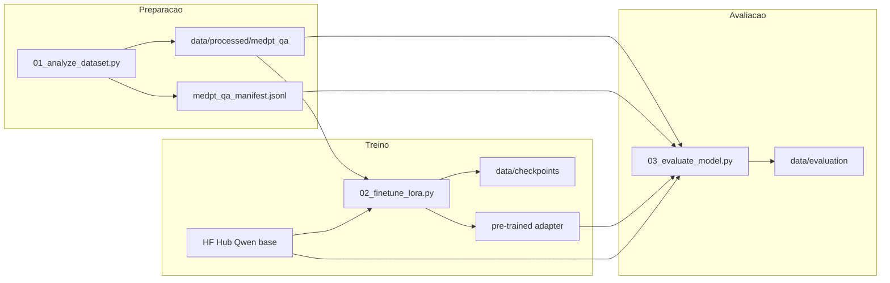

# Ambiente Google Colab: `02_finetune_lora.py` e `03_evaluate_model.py`

Este guia implementa o fluxo de preparação de dados, fine-tuning LoRA e avaliação no Google Colab. Caminhos abaixo são **relativos à raiz do repositório** (`Tech-Challenge-FIAP-FASE3/`). Antes de cada `!python`, use `%cd` na raiz do projeto clonado ou descompactado.

Referência de hardware (exemplo de sessão Colab): [collab.txt](collab.txt).

---

## Pré-requisitos no Colab

1. **GPU:** **Runtime → Change runtime type → Hardware accelerator: T4 GPU** (ou superior). Os scripts usam quantização 4-bit com CUDA (`load_in_4bit` no treino; `BitsAndBytesConfig` na avaliação).
2. **Hugging Face (se necessário):** se o modelo exigir aceite de licença, configure **Secrets** com `HF_TOKEN` ou execute `huggingface-cli login` antes de baixar `Qwen/Qwen2.5-3B-Instruct`.

---

## 1) Obter o código do projeto

Escolha uma opção e defina a raiz (ex.: `/content/Tech-Challenge-FIAP-FASE3`):


- (NAO)**Git:** `!git clone <URL_DO_REPOSITORIO> /content/Tech-Challenge-FIAP-FASE3`
- (NAO)**ZIP:** enviar o zip e `!unzip -q arquivo.zip -d /content/`
- **Google Drive:** `drive.mount('/content/drive')` e copiar a pasta do projeto para `/content/` (útil para persistir checkpoints depois)

Em **toda** célula que rodar scripts:

```python
%cd /content/Tech-Challenge-FIAP-FASE3
```

Substitua pelo caminho real da raiz se for diferente. A raiz deve conter a pasta `tunning/` e, após o passo de dados, `data/processed/`.

---

## 2) Instalar dependências

**Opção A (recomendada para estes três scripts):** arquivo [requirements-finetune.txt](../requirements-finetune.txt) na raiz do repo:

```bash
!pip install -q -r requirements-finetune.txt
```

**(NAO)Opção B (projeto completo):** `pip install -r requirements.txt` (inclui LangChain, FAISS etc., não obrigatório para 02/03).

Se o Colab avisar conflito de versões de `torch` ou `numpy` após instalar Unsloth: **Runtime → Restart session** e rode de novo `pip install -r requirements-finetune.txt`, depois continue a partir do `%cd`.

---

## 3) Dataset processado (`data/processed/`)

Os scripts `02` e `03` assumem por padrão:

- `--dataset-dir data/processed/medpt_qa`
- No `03`, também `--manifest-path data/processed/medpt_qa_manifest.jsonl` (gerado pelo `01`)

(NAO)Execute o script 01 **na raiz do projeto**. Exemplo baixando o parquet do Hugging Face:

```bash
!python tunning/01_analyze_dataset.py \
  --dataset-path "https://huggingface.co/datasets/AKCIT/MedPT/resolve/main/data/train-00000-of-00001.parquet"
```

Saídas esperadas:

- `data/processed/medpt_qa/` (DatasetDict em disco)
- `data/processed/medpt_qa_manifest.jsonl`
- `data/processed/medpt_qa_report.json`

(SIM)**Alternativa:** zipar `data/processed/` no seu computador e extrair na raiz do projeto no Colab.

---

## 4) Fine-tuning (`02_finetune_lora.py`)

Na raiz do projeto:

```bash
!python tunning/02_finetune_lora.py \
  --dataset-dir data/processed/medpt_qa \
  --checkpoint-dir data/checkpoints/qwen2.5-3b-medpt-lora \
  --final-dir pre-trained/qwen2.5-3b-medpt-lora
```

**Dry run (opcional):** validar pipeline com poucas amostras:

```bash
!python tunning/02_finetune_lora.py \
  --dataset-dir data/processed/medpt_qa \
  --max-train-samples 512 \
  --max-validation-samples 128 \
  --checkpoint-dir data/checkpoints/qwen2.5-3b-medpt-lora \
  --final-dir pre-trained/qwen2.5-3b-medpt-lora
```

**Saídas:** checkpoints em `data/checkpoints/...`; adapter, tokenizer e `training_metadata.json` em `pre-trained/...` (conforme `--final-dir`).

O primeiro uso do Qwen dispara download do Hub para o cache (`~/.cache/huggingface`).

**OOM na T4:** reduzir `--per-device-train-batch-size`, `--max-seq-length`, ou aumentar `--gradient-accumulation-steps`.

---

## 5) Avaliação (`03_evaluate_model.py`)

Somente **depois** de existir o diretório do adapter (ex.: `pre-trained/qwen2.5-3b-medpt-lora`).

```bash
!python tunning/03_evaluate_model.py \
  --dataset-dir data/processed/medpt_qa \
  --manifest-path data/processed/medpt_qa_manifest.jsonl \
  --adapter-dir pre-trained/qwen2.5-3b-medpt-lora \
  --base-model-name Qwen/Qwen2.5-3B-Instruct \
  --output-dir data/evaluation/qwen2.5-3b-medpt-lora
```

Flags úteis: `--max-eval-samples`, `--compute-bertscore` (requer `bert-score` em `requirements-finetune.txt`).

Saídas típicas: `data/evaluation/.../evaluation_summary.json` e `predictions.jsonl`.

---

## 6) Persistência

Sessões Colab apagam `/content` ao desconectar. Copie para o **Google Drive** (ou outro storage):

- `data/checkpoints/`
- `pre-trained/`
- `data/evaluation/`

Garanta espaço em disco para cache do Hugging Face, checkpoints e modelo base.

---

## Fluxo resumido


